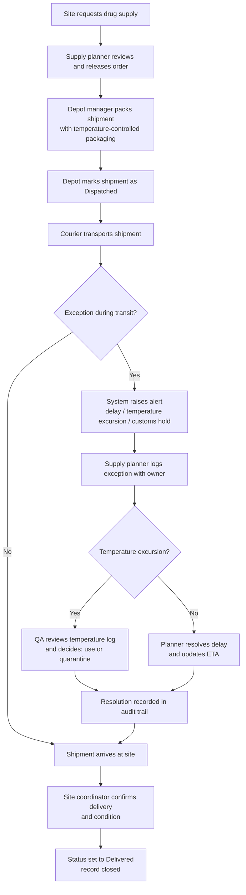

# Process Flow: Order to Delivery (with Exception Handling)

## Swimlane summary

| Step | Owner |
|---|---|
| Request supply | Site coordinator |
| Review and release order | Supply planner |
| Pack and dispatch | Depot manager |
| Transport | Courier / logistics partner |
| Log and resolve exceptions | Supply planner |
| Decide use or quarantine | QA reviewer |
| Confirm delivery | Site coordinator |
